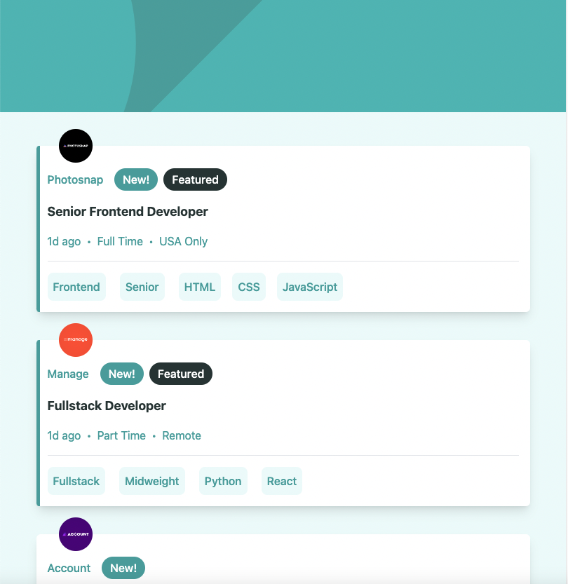
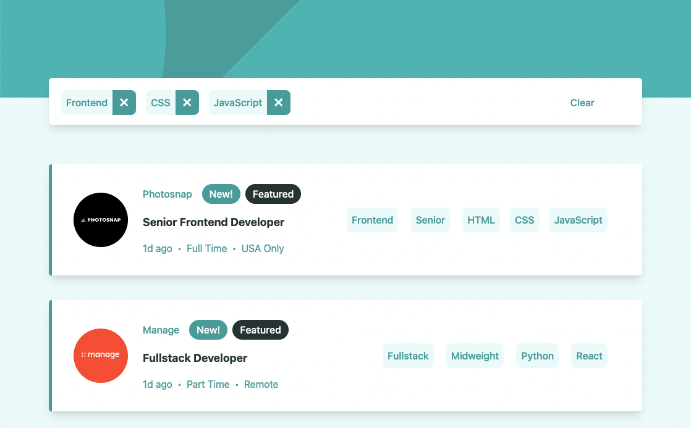
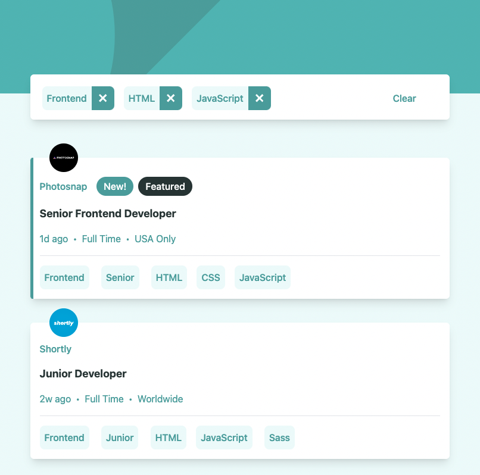

# Frontend Mentor - Job listings with filtering solution

This is a solution to the [Job listings with filtering challenge on Frontend Mentor](https://www.frontendmentor.io/challenges/job-listings-with-filtering-ivstIPCt). Frontend Mentor challenges help you improve your coding skills by building realistic projects. 

## Table of contents

- [Overview](#overview)
  - [The challenge](#the-challenge)
  - [Screenshot](#screenshot)
  - [Links](#links)
- [My process](#my-process)
  - [Built with](#built-with)
  - [What I learned](#what-i-learned)
  - [Continued development](#continued-development)
  - [Useful resources](#useful-resources)
- [Author](#author)

## Overview

### The challenge

Users should be able to:

- View the optimal layout for the site depending on their device's screen size
- See hover states for all interactive elements on the page
- Filter job listings based on the categories

### Screenshot





### Links

- Solution URL: [Github](https://github.com/TimmyLin21/Job-listings-with-filtering)
- Live Site URL: [Github Page](https://timmylin21.github.io/Job-listings-with-filtering/)

## My process

### Built with

- Semantic HTML5 markup
- Tailwind
- Flexbox
- Vanilla Javascript
- ESLint - Airbnb style guide
- Mobile-first workflow

### What I learned
For single-use or arbitrary values, square bracket notation, like bg-[#5ca5a4], can generate a class on the fly. Another option is extending the default theme in config. 
```html
<header class="h-40 bg-[#5ca5a4]">
  <div class="h-40 bg-cover bg-center bg-header-mobile xl:bg-header-desktop"></div>
</header>
```
Using pseudo-elements to create a simple border effect.
```css
.card-highlight {
  @apply before:block before:absolute before:h-full before:w-[5px] before:bg-primary before:rounded-l-[5px]
}
```
It's a common css skill for changing the padding of list style.
```css
.list-dot {
  @apply before:pr-2 before:text-primary before:content-['•']
}
```
Using function keys from Object helps me to reduce the code while writting function filterData. Although there might be a little bit too many parameters inside the function which could make you feel frustrated. 
```js
const filterItems = {
  role: '',
  level: '',
  languages: [],
  tools: [],
};

const keys = Object.keys(filterItems);

// filterData
function filterData() {
  keys.forEach((key, i) => {
    if (i <= 1) {
      if (filterItems[key]) {
        if (filteredData.length !== 0) {
          const filteredArr = filteredData.filter((item) => item[key] === filterItems[key]);
          filteredData = filteredArr;
        } else {
          const filteredArr = allData.filter((item) => item[key] === filterItems[key]);
          filteredData = filteredArr;
        }
      }
    } else if (i >= 2) {
      if (filterItems[key]) {
        filterItems[key].forEach((item) => {
          if (filteredData.length !== 0) {
            const filteredArr = filteredData.filter((data) => data[key].includes(item));
            filteredData = filteredArr;
          } else {
            const filteredArr = allData.filter((data) => data[key].includes(item));
            filteredData = filteredArr;
          }
        });
      }
    }
  });
}
```
This expression efficiently helps me to find out whether my template Object whose values includes string and array is empty or not. Then, I can decide if I should hidden the list.
```js
// close the filter while list is empty
if (Object.values(filterItems).join('') === '') {
  filterCard.classList.add('hidden');
  renderData(allData);
  addBtnEvent();
}
```

### Continued development

First of all, I would like to get familiar with Web Accessibility, such as WAI-ARIA and AOM. Secondly, I'm getting used to using Tailwind but there is still room for improvement. Therefore, I'll keep using tailwind for next project. Last but not least, I'm going to practice using Vue for the next project as well.    

### Useful resources

- [Tailwind](https://tailwindcss.com/) - This guided me through the project. I really liked how detailed it is and will use it going forward.

## Author

- Github - [@TimmyLin21](https://github.com/TimmyLin21)
- Frontend Mentor - [@TimmyLin21](https://www.frontendmentor.io/profile/TimmyLin21)


